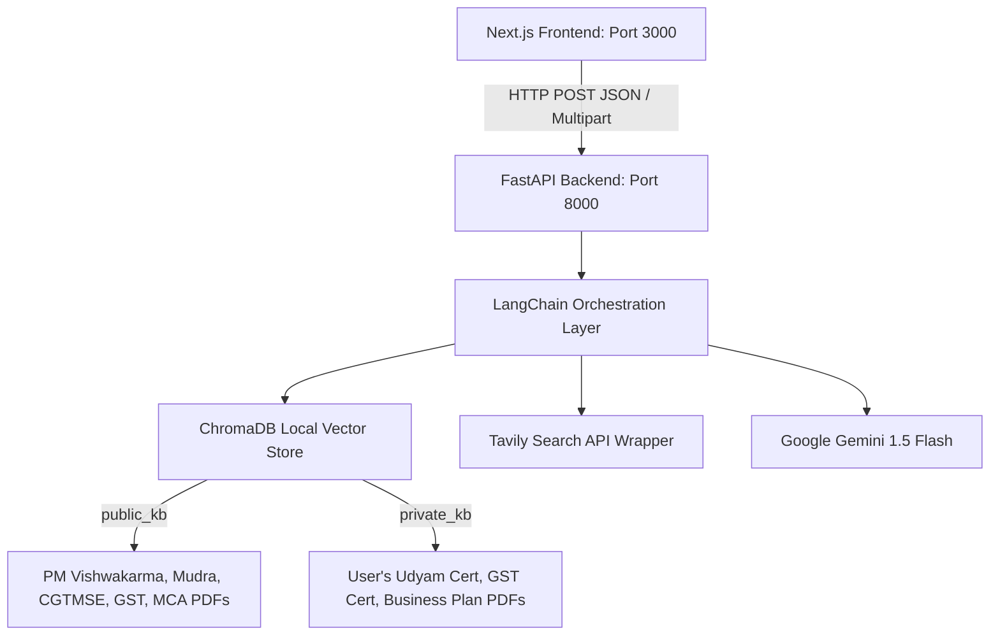

# Jarvis Architecture Documentation

Jarvis is a Retrieval-Augmented Generation (RAG) business intelligence assistant designed to query both **public regulatory guides** and **private user-uploaded documents** simultaneously, incorporating live search results when necessary, and answering with context-grounded citations.

---

## 1. System Topology

---

## 2. End-to-End Query Execution Flow

Every time a user inputs a query in the chat console, the following sequence occurs:

1. **API Call**: The Next.js frontend calls the unified API module (`src/lib/api.ts`), passing the query, `business_id` context, and `threshold` parameter as JSON payload to `/chat`.
2. **FastAPI Route**: The backend `/chat` endpoint in `main.py` parses the request via Pydantic (`models.py`) and calls `get_answer()` in `rag/chain.py`.
3. **Retrieval Phase**:
   - The system queries the `public_kb` collection in ChromaDB for matching guidelines.
   - The system queries the `private_kb` collection in ChromaDB for matching chunks, using a metadata filter: `{"business_id": business_id}`.
   - The system triggers a parallel web search using Tavily to fetch fresh web content.
4. **Result Merging**: The system aggregates all public chunks, private chunks, and Tavily hits into a single list.
5. **Confidence Rating & Thresholding**:
   - The system extracts similarity scores for all hits and identifies the maximum score (`best_score`).
   - If `best_score < 0.50`, the query is flagged as **Low Confidence**. The system immediately skips the LLM call and returns a refusal message to prevent hallucination.
   - If `0.50 <= best_score <= 0.75`, the query is flagged as **Medium Confidence**. The system generates an answer, but appends a caution warning disclaimer.
   - If `best_score > 0.75`, the query is flagged as **High Confidence** and answers normally.
6. **Prompt Assembly**: The top 5 matching sources (sorted by similarity score descending) are formatted into text blocks and embedded in the strict grounding system prompt.
7. **Gemini Invocation**: The system queries `gemini-1.5-flash` with the system prompt containing context and the user query.
8. **JSON Serialization**: The generated text, citation source metadata (names, scores, excerpts, URLs), and confidence category are serialized into a `ChatResponse` model and returned to the UI.

---

## 3. Data Flow Comparison

| Feature | Private KB Retrieval | Public KB Retrieval | Live Web search (Tavily) |
| :--- | :--- | :--- | :--- |
| **Source Type** | User's local uploaded PDFs | Pre-indexed government schemes | Real-time google search pages |
| **Search Mechanism** | Semantic Vector matching | Semantic Vector matching | API-driven keywords search |
| **Metadata Tagging** | `business_id`, `domain: private` | `domain: public` | `domain: live_web` |
| **Primary Scope** | Specific company details | Standard regulations & checklists | Current interest rates & updates |
| **Ingestion Type** | Memory stream parser (PyMuPDF) | Standalone script loader (`ingest.py`) | Query-time fetch |
